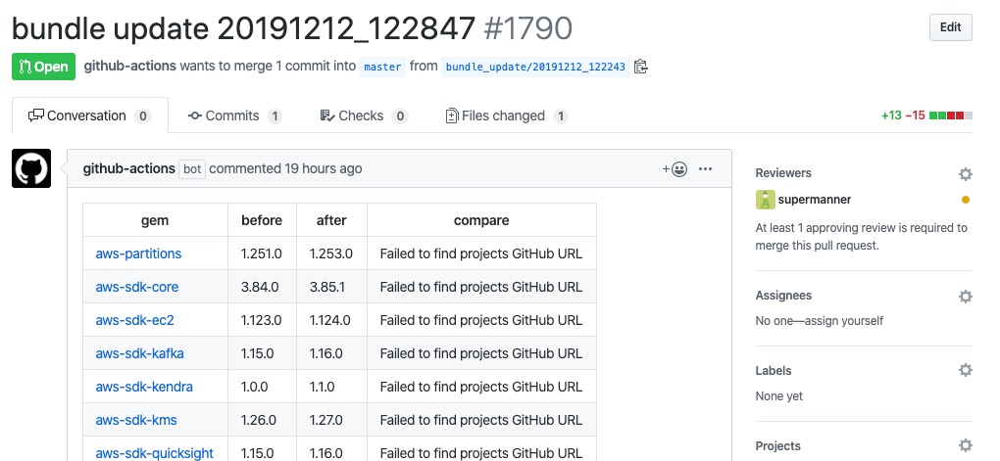

# Pull request on bundle update
This Github Action is that send pull request on bundle update and then uses [bundler-diff](https://github.com/sinsoku/bundler-diff) to display a table for the updated gems. Addtionally, if you are using artifactory for accessing and hosting private gems you can provide some jfrog information in order to ensure those can be accessed. 

This Github Action is running on **ruby2.7-alpine**.

## Usage
※ Without Gemfile and Gemfile.lock, this workflow is failure. 

```
name: pull request on bundle update
on:
  schedule:
    - cron: '*/15 * * * *'

jobs:
  bundle-update:
    name: bundle update
    runs-on: ubuntu-latest
    steps:
      - name: Checkout
        uses: actions/checkout@v1
        with:
          fetch-depth: 1
      - name: pull request on bundle update
        uses: supermanner/pull-request-on-bundle-update@v1.0.1
        with:
          github_token: ${{ secrets.GITHUB_TOKEN }}
          git_user_name: example_name
          git_email: test@example.com
          reviewers: supermanner,hoge,fuga // optional
          bundler_version: 2.0.1 // optional
          jfrog_path: example.jfrog.io // optional
          jfrog_username: example%40example.com // optional
          jfrog_api_token: ${{ secrets.JFROG_API_TOKEN }} // optional
```

## Demo


## Contributing
Bug reports and pull requests are welcome on GitHub at [pull-request-on-bundle-update-with-optional-jfrog](https://github.com/LindseyB/pull-request-on-bundle-update-with-optional-jfrog).

## License
The plugin is available as open source under the terms of the [MIT License](https://opensource.org/licenses/MIT).
